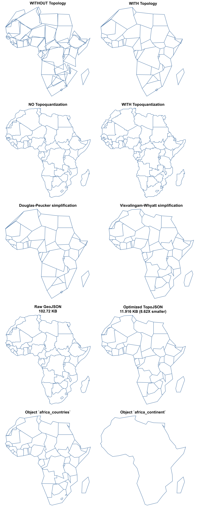

# topojson

[](https://pypi.org/project/topojson)
[](https://opensource.org/licenses/BSD-3-Clause)
[](https://github.com/mattijn/topojson/actions?query=workflow%3Atest)
[](https://anaconda.org/conda-forge/topojson)


# Encode spatial data as topology in Python!

Topojson is a library that is capable of creating a topojson encoded format of merely any spatial object in Python.

With topojson it is possible to reduce the size of your spatial data. Mostly by orders of magnitude. It is able to do so through:

- Eliminating redundancy through computation of a topology
- Fixed-precision integer encoding of coordinates and
- Simplification and quantization of arcs

See [Topojson Documentation Site](https://mattijn.github.io/topojson) for all info how to use this package.

## Usage

The package can be used in multiple different ways, with the main purpose to create a TopoJSON topology. 

See the Python [Topojson Documentation Site](https://mattijn.github.io/topojson) for all info or [this Notebook](https://nbviewer.jupyter.org/github/mattijn/topojson/blob/main/notebooks/topojson.ipynb) with some examples, such as the following:

<p align="center">
<a href="https://nbviewer.jupyter.org/github/mattijn/topojson/blob/main/notebooks/topojson.ipynb" target="_blank" rel="noopener noreferrer"></a>
</p>

_Click on the image to go the Notebook Viewer with code-snippets how these images are created or visit the [Topojson Documentation Site](https://mattijn.github.io/topojson)._ 

## Installation

Installation can be done through PyPI by the following command:

```
python -m pip install topojson
```

And through conda using the following command:

```
conda install topojson -c conda-forge
```

This package `topojson` has the following hard dependencies:

- `numpy`
- `shapely`
- `packaging`

Further, optional soft dependencies are:

- `altair` - enlarge the experience by visualizing your TopoJSON output
- `simplification` - more and quicker simplification options
- `geojson` - parse string input with GeoJSON data
- `geopandas` - parse your TopoJSON output directly into a GeoDataFrame
- `ipywidgets` + (lab)extension - make your life complete with the interactive experience

## Other resources

For a better understanding how the different included simplification algorithms work

- `rdp`: Ramer–Douglas–Peucker
- `vw`: Visvalingam-Whyatt

You can have a look to this blog post on [Line simplification algorithms](https://martinfleischmann.net/line-simplification-algorithms/).
There you can find out that the `epsilon` value for `vw` is area-based and that the `epsilon` value for `rdp` is distance-based.

Also, if your source projection is in meters, than it is very likely that your `epsilon` value should be magnitudes larger than the examples on this page where the source projection is in degrees.

There is a [section](https://py.geocompx.org/04-geometry-operations#sec-simplification) on simplification in the book on '[Geocomputation with Python](https://py.geocompx.org/)' that describes toposimplification as follow:

> _The main advantage of `.toposimplify` is that it is topologically “aware”: it simplifies the combined borders of the polygons (rather than each polygon on its own), thus ensuring that the overlap is maintained._

## Get in touch

For now, just use the Github issues. That can be:

- usage questions
- bug reports
- feature suggestions
- or anything related

Finally, see the Python [Topojson Documentation Site](https://mattijn.github.io/topojson) for all info how to use this package.
