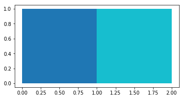

# TopoJSON

[](https://pypi.org/project/topojson)
[](https://opensource.org/licenses/BSD-3-Clause)

[Ready for Beta Users!]

_TopoJSON_ encodes geographic data structures into a shared topology. This repository describes the development of a **Python** implementation of this TopoJSON format. A TopoJSON topology represents one or more geometries that share sequences of positions called arcs.

## Usage

The package can be used in multiple different ways, with the purpose to create a TopoJSON topology:

```python
import topojson

data = [
    {"type": "Polygon", "coordinates": [[[0, 0], [1, 0], [1, 1], [0, 1], [0, 0]]]},
    {"type": "Polygon", "coordinates": [[[1, 0], [2, 0], [2, 1], [1, 1], [1, 0]]]}
]

tj = topojson.Topology(data, prequantize=False, topology=True)
tj.to_json()
```

```json
{"type": "Topology", "linestrings": [[[1.0, 0.0], [0.0, 0.0], [0.0, 1.0], [1.0, 1.0]], [[1.0, 0.0], [1.0, 1.0]], [[1.0, 1.0], [2.0, 1.0], [2.0, 0.0], [1.0, 0.0]]], "objects": {"data": {"geometries": [{"type": "Polygon", "arcs": [[-2, 0]]}, {"type": "Polygon", "arcs": [[1, 2]]}], "type": "GeometryCollection"}}, "bbox": [0.0, 0.0, 2.0, 1.0], "arcs": [[[1.0, 0.0], [0.0, 0.0], [0.0, 1.0], [1.0, 1.0]], [[1.0, 0.0], [1.0, 1.0]], [[1.0, 1.0], [2.0, 1.0], [2.0, 0.0], [1.0, 0.0]]]}
```

This is TopoJSON.

The following geometry types are registered as correct geographical input data:

- `geojson.Feature`
- `geojson.FeatureCollection`
- `geopandas.GeoDataFrame`
- `geopandas.GeoSeries`
- `shapely.geometry.LineString`
- `shapely.geometry.MultiLineString`
- `shapely.geometry.Polygon`
- `shapely.geometry.MultiPolygon`
- `shapely.geometry.Point`
- `shapely.geometry.MultiPoint`
- `shapely.geometry.GeometryCollection`
- `dict` of objects that provide a valid `__geo_interface__`
- `list` of objects that provide a valid `__geo_interface__`

## Installation

The package is released on PyPi as version `1.0rc3`. Installation can be done by:

```
python3 -m pip install topojson
```

The required dependencies are:

- `numpy`
- `shapely`
- `simplification`
- `geojson`

Download dependencies from https://www.lfd.uci.edu/~gohlke/pythonlibs/ for Windows where possible and use `pip` for Linux and Mac.

The packages `geopandas` and `geojson` are solely used in the tests and recognized as types with the extractor.

For better experience make sure you have `altair` installed as well.
For the interactive experience also install `ipywidgets`.


## Examples and tutorial notebooks

### Input Type: `list`

The list should contain items that supports the `__geo_interface__`

```python
import topojson

list_geoms = [
    {"type": "Polygon", "coordinates": [[[0, 0], [1, 0], [1, 1], [0, 1], [0, 0]]]},
    {"type": "Polygon", "coordinates": [[[1, 0], [2, 0], [2, 1], [1, 1], [1, 0]]]}
]
```

#

#### apply Topology and present the output as dict
```python
tj = topojson.Topology(data, prequantize=False, topology=True)
tj.to_dict()
```

```python
{'type': 'Topology',
 'linestrings': [[[1.0, 0.0], [0.0, 0.0], [0.0, 1.0], [1.0, 1.0]],
  [[1.0, 0.0], [1.0, 1.0]],
  [[1.0, 1.0], [2.0, 1.0], [2.0, 0.0], [1.0, 0.0]]],
 'objects': {'data': {'geometries': [{'type': 'Polygon', 'arcs': [[-2, 0]]},
    {'type': 'Polygon', 'arcs': [[1, 2]]}],
   'type': 'GeometryCollection'}},
 'options': TopoOptions(
   {'prequantize': False,
  'presimplify': False,
  'simplify_with': 'shapely',
  'topology': True,
  'topoquantize': False,
  'toposimplify': 0.0001,
  'winding_order': 'CW_CCW'}
 ),
 'bbox': (0.0, 0.0, 2.0, 1.0),
 'arcs': [[[1.0, 0.0], [0.0, 0.0], [0.0, 1.0], [1.0, 1.0]],
  [[1.0, 0.0], [1.0, 1.0]],
  [[1.0, 1.0], [2.0, 1.0], [2.0, 0.0], [1.0, 0.0]]]}
```

#

### Input Type: `dict`

The dictionary should be structured like {`key1`: `obj1`, `key2`: `obj2`}.

```python
import topojson

dictionary = {
    0: {
        "type": "Polygon",
        "coordinates": [[[0, 0], [1, 0], [1, 1], [0, 1], [0, 0]]],
    },
    1: {
        "type": "Polygon",
        "coordinates": [[[1, 0], [2, 0], [2, 1], [1, 1], [1, 0]]],
    }
}
```

#

#### apply Topology and present the output as scalable vector graphic
```python
tj = topojson.Topology(dictionary, prequantize=False, topology=True)
tj.to_svg()
```


#

### Input Type: `GeoDataFrame` from package `geopandas` (if installed)

```python
import geopandas
import topojson
from shapely import geometry
%matplotlib inline

gdf = geopandas.GeoDataFrame({
    "name": ["abc", "def"],
    "geometry": [
        geometry.Polygon([[0, 0], [1, 0], [1, 1], [0, 1], [0, 0]]),
        geometry.Polygon([[1, 0], [2, 0], [2, 1], [1, 1], [1, 0]])
    ]
})
gdf.plot(column="name")
gdf.head()
```

<div>
<table border="1" class="dataframe">
  <thead>
    <tr style="text-align: right;">
      <th></th>
      <th>name</th>
      <th>geometry</th>
    </tr>
  </thead>
  <tbody>
    <tr>
      <th>0</th>
      <td>abc</td>
      <td>POLYGON ((0 0, 1 0, 1 1, 0 1, 0 0))</td>
    </tr>
    <tr>
      <th>1</th>
      <td>def</td>
      <td>POLYGON ((1 0, 2 0, 2 1, 1 1, 1 0))</td>
    </tr>
  </tbody>
</table>
</div>



#

#### apply Topology and present output as `altair` chart (if installed)

```python
tj = topojson.Topology(gdf, prequantize=False, topology=True)
tj.to_alt(color='properties.name:N')
```


#

### Input Type: `FeatureCollection` from package `geojson` (if installed)

```python
from geojson import Feature, Polygon, FeatureCollection

feature_1 = Feature(
    geometry=Polygon([[[0, 0], [1, 0], [1, 1], [0, 1], [0, 0]]]),
    properties={"name":"abc"}
)
feature_2 = Feature(
    geometry=Polygon([[[1, 0], [2, 0], [2, 1], [1, 1], [1, 0]]]),
    properties={"name":"def"}
)
feature_collection = FeatureCollection([feature_1, feature_2])
```

#

#### apply Topology and present output as `geodataframe` (if `geopandas` is installed)
```python
tj = topojson.Topology(feature_collection, prequantize=False, topology=True)
tj.to_gdf()
```

<table border="1" class="dataframe">
  <thead>
    <tr style="text-align: right;">
      <th></th>
      <th>geometry</th>
      <th>id</th>
      <th>name</th>
    </tr>
  </thead>
  <tbody>
    <tr>
      <th>0</th>
      <td>POLYGON ((1 1, 1 0, 0 0, 0 1, 1 1))</td>
      <td>None</td>
      <td>abc</td>
    </tr>
    <tr>
      <th>1</th>
      <td>POLYGON ((1 0, 1 1, 2 1, 2 0, 1 0))</td>
      <td>None</td>
      <td>def</td>
    </tr>
  </tbody>
</table>
</div>


#

The notebooks folder of this GitHub repository also contains a Jupyter Notebook with a [tutorial][l1]. The many [tests][l2] as part of this package also can be used as example material.

[l1]: https://github.com/mattijn/topojson/blob/master/notebooks/example%20usage.ipynb
[l2]: https://github.com/mattijn/topojson/tree/master/tests

## Changelog

Version `1.0rc3`:
- TODO

Version `1.0rc2`:

- apply linemerge on non-duplicate arcs
- fix computing topology without shared boundaries ([#1][i1], [#3][i3])
- use `geopandas` and `geojson` solely for tests, but recognize them as type ([#2][i2], [#4][i4])
- use [`simplification`](https://github.com/urschrei/simplification) as option to simplify linestrings
- include option to snap vertices to grid
- removed `rdtree` as dependency, use `SRTtree` from `shapely` instead

Version `1.0rc1`:

- initial release

[i1]: https://github.com/mattijn/topojson/issues/1
[i2]: https://github.com/mattijn/topojson/issues/2
[i3]: https://github.com/mattijn/topojson/issues/3
[i4]: https://github.com/mattijn/topojson/issues/4

## Development Notes

Development of this packages started by reading:

- https://bost.ocks.org/mike/topology/ and https://github.com/topojson by Mike Bostocks and
- https://github.com/calvinmetcalf/topojson.py by Calvin Metcalf.

The reason for development of this package was the willingness:

- To adopt `shapely` (GEOS) and `numpy` for the core-functionalities in deriving the Topology.
- To provide integration with other geographical packages within the Python ecosystem (eg. `geopandas` and `altair`).
- Also the possibility of including the many tests available in the JavaScript implementation was hoped-for.

To create a certain synergy between the JavaScript and Python implementation the same naming conventions was adopted for the processing steps (`extract`, `join`, `cut`, `dedup`, `hashmap`). Even though the actual code differs significant.

Some subtile differences are existing between the JavaScript implementation and the current Python implementation for deriving the Topology. Some of these deviations are briefly mentioned here:

1. The extraction class stores all the different geometrical objects as Shapely LineStrings in `linestrings` and keeps a record of these linestrings available under the key `bookkeeping_geoms`. In the JavaScript implementation there is a differentiation of the geometries between `lines`, `rings` and a seperate object containing all `coordinates`. Since the current approach adopts `shapely` for much of the heavy lifting this extraction is working against us (in the cut-process).

2. In the join class only the geometries that have shared paths are considered to have junctions. This means that the intersection of two crossing lines at a single coordinate is not considered as a junction. This also means that the two ends of a LineString are not automatically considered as being a junction. So if a segment starts or finish on another segment, with that coordinate being the only coordinate in common, it is not considered as a junction.

3. In the computation of a shared path, a junction can be created on an existing coordinate in one of the geometries. Where in the JavaScript implementation this only can be considered when both geometries contain the coordinate.

4. In the process of cutting lines; the rings are rotated in the JavaScript implementation to make sure they start at a junction. This reduces the number of cuts. This rotation is done before cutting. In the current Python implementation this is done differently. First the linestrings are cut using the junction coordinates and afterwards there is tried to apply a linemerge on the non-duplicate arcs of a geometry containing at least one shared arc.
