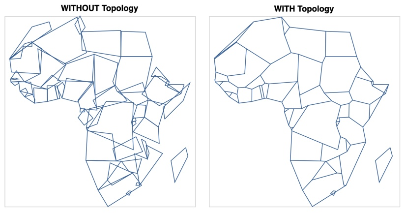

# topojson

[](https://pypi.org/project/topojson)
[](https://opensource.org/licenses/BSD-3-Clause)
[](https://travis-ci.org/mattijn/topojson)

# Encode geographic data as topology in Python!

Topojson is a library that is capable of creating a topojson encoded format of merely any geographical object in Python.

With topojson it is possible to reduce the size of your geographical data. Mostly by orders of magnitude. It is able to do so through:

- Eliminating redundancy through computation of a topology
- Fixed-precision integer encoding of coordinates and
- Simplification and quantization of arcs


## Usage

The package can be used in multiple different ways, with the main purpose to create a TopoJSON topology. 

See the Python [Topojson Documentation Site](https://mattijn.github.io/topojson) for all info or [this Notebook](https://nbviewer.jupyter.org/github/mattijn/topojson/blob/master/notebooks/topojson.ipynb) with some examples, such as the following:

<p align="center">

</p>

_Top row (right) presents linestring simplification on a computed Topology and (left) on the geographical object directly. Bottom row presents visual impact on file size reduction between (left) Raw GeoJSON and (right) Topological optimized TopoJSON._ 

## Installation

Installation can be done by:

```
python3 -m pip install topojson
```

This package `topojson` has the following hard dependencies:

- `numpy`
- `shapely`

Further, optional soft dependencies are:

- `altair` (enlarge the experience by visualizing your TopoJSON output)
- `simplification` (more and quicker simplification options)
- `geojson` (parse string input with GeoJSON data)
- `geopandas` (with `fiona` version >=1.8.6!, parse your TopoJSON output directly into a GeoDataFrame)
- `ipywidgets` + (lab)extension (make your life complete with the interactive experience)

## Get in touch

For now, just use the Github issues. That can be:

- usage questions
- bug reports
- feature suggestions
- or anything related

Finally, see the Python [Topojson Documentation Site](https://mattijn.github.io/topojson) for more info.
