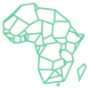
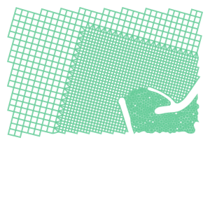
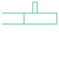
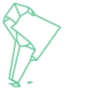
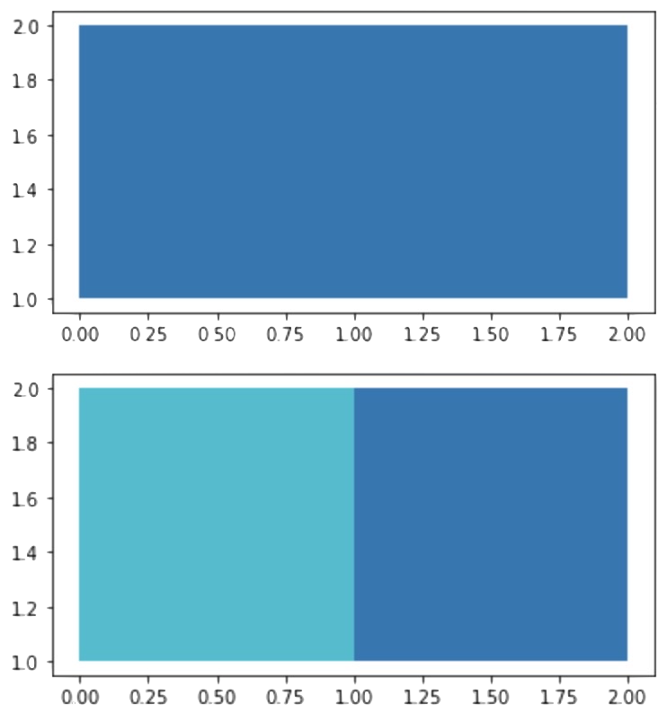

# Types of input data
{: .no_toc}

This library can be useful for you if you have if one of the following geographical input data:

1. TOC
{:toc}

* * * 

## GeoDataFrame or GeoSeries
From the package `geopandas` (not a hard dependency)

<div class="code-example mx-1 bg-example">
<div class="example-label" markdown="1">
Example 🔧
{: .label .label-blue-000 }
</div>
<div class="example-text" markdown="1">

```python
import topojson as tp
import geopandas
from shapely import geometry
%matplotlib inline

gdf = geopandas.GeoDataFrame({
    "name": ["abc", "def"],
    "geometry": [
        geometry.Polygon([[0, 0], [1, 0], [1, 1], [0, 1], [0, 0]]),
        geometry.Polygon([[1, 0], [2, 0], [2, 1], [1, 1], [1, 0]])
    ]
})
gdf.plot(column="name")
gdf.head()
```

|   | name| geometry                            |
|:--|:----|:------------------------------------|
| 0 | abc | POLYGON ((0 0, 1 0, 1 1, 0 1, 0 0)) |
| 1 | def | POLYGON ((1 0, 2 0, 2 1, 1 1, 1 0)) |


```python
tp.Topology(gdf, prequantize=False).to_json()
```

```python
{
    "type": "Topology",
    "objects": {
        "data": {
            "geometries": [
                {
                    "id": "0",
                    "type": "Polygon",
                    "properties": {"name": "abc"},
                    "bbox": [0.0, 0.0, 1.0, 1.0],
                    "arcs": [[-2, 0]]
                },
                {
                    "id": "1",
                    "type": "Polygon",
                    "properties": {"name": "def"},
                    "bbox": [1.0, 0.0, 2.0, 1.0],
                    "arcs": [[1, 2]]
                }
            ],
            "type": "GeometryCollection"
        }
    },
    "bbox": [0.0, 0.0, 2.0, 1.0],
    "arcs": [
        [[1.0, 0.0], [0.0, 0.0], [0.0, 1.0], [1.0, 1.0]], [[1.0, 0.0], [1.0, 1.0]],
        [[1.0, 1.0], [2.0, 1.0], [2.0, 0.0], [1.0, 0.0]]
    ]
}
```
</div>
</div>

* * *

## GeoJSON data from file
A GeoJSON file can be parsed as json dictionary.

<div class="code-example mx-1 bg-example">
<div class="example-label" markdown="1">
Example 🔧
{: .label .label-blue-000 }
</div>
<div class="example-text" markdown="1">

```python
import topojson as tp
import json

with open("tests/files_topojson/example_data_africa.geojson", 'r') as f:
    data = json.load(f)

assert data['type'] == 'FeatureCollection'
topo = topojson.Topology(data)

# to visualize we use the (optional!) package Altair.
topo.toposimplify(4).to_alt()
```
<div id="embed_output_mesh_altair_from_geojson"></div>
</div>
</div>

* * * 

## TopoJSON data from file
A TopoJSON file can be post-processed using json dictionary.

<div class="code-example mx-1 bg-example">
<div class="example-label" markdown="1">
Example 🔧
{: .label .label-blue-000 }
</div>
<div class="example-text" markdown="1">

```python
import topojson as tp
import json

with open("tests/files_topojson/naturalearth_lowres_africa.topojson", 'r') as f:
    data = json.load(f)
# parse topojson file using `object_name`
topo = topojson.Topology(data, object_name="data")
topo.toposimplify(4).to_svg()
```

</div>
</div>

* * * 


## FeatureCollection or Features
From the package `geojson` (not a hard dependency)

<div class="code-example mx-1 bg-example">
<div class="example-label" markdown="1">
Example 🔧
{: .label .label-blue-000 }
</div>
<div class="example-text" markdown="1">

```python
import topojson as tp
from geojson import Feature, Polygon, FeatureCollection


feat_1 = Feature(
    geometry=Polygon([[[0, 0], [1, 0], [1, 1], [0, 1], [0, 0]]]),
    properties={"name":"abc"}
)
feat_2 = Feature(
    geometry=Polygon([[[1, 0], [2, 0], [2, 1], [1, 1], [1, 0]]]),
    properties={"name":"def"}
)
fc = FeatureCollection([feat_1, feat_2])

tp.Topology(fc, prequantize=False).to_json()
```

```python
{
    "type": "Topology",
    "objects": {
        "data": {
            "geometries": [
                {"type": "Polygon", "properties": {"name": "abc"}, "arcs": [[-2, 0]]},
                {"type": "Polygon", "properties": {"name": "def"}, "arcs": [[1, 2]]}
            ],
            "type": "GeometryCollection"
        }
    },
    "bbox": [0.0, 0.0, 2.0, 1.0],
    "arcs": [
        [[1.0, 0.0], [0.0, 0.0], [0.0, 1.0], [1.0, 1.0]], [[1.0, 0.0], [1.0, 1.0]],
        [[1.0, 1.0], [2.0, 1.0], [2.0, 0.0], [1.0, 0.0]]
    ]
}
```
</div>
</div>

* * * 

## fiona.Collection
From the package `fiona` (not a hard dependency)

<div class="code-example mx-1 bg-example">
<div class="example-label" markdown="1">
Example 🔧
{: .label .label-blue-000 }
</div>
<div class="example-text" markdown="1">

```python
import topojson as tp
import fiona

with fiona.open('tests/files_shapefile/mesh2d.geojson') as fio_col:
    topo = tp.Topology(fio_col)

topo.to_svg()
```

</div>
</div>

* * *

## `shapely.geometry` object
From the package `shapely`

<div class="code-example mx-1 bg-example">
<div class="example-label" markdown="1">
Example 🔧
{: .label .label-blue-000 }
</div>
<div class="example-text" markdown="1">

```python
import topojson as tp
from shapely import geometry

data = geometry.MultiLineString([
    [(0, 0), (10, 0), (10, 5), (20, 5)], 
    [(5, 0), (25, 0), (25, 5), (16, 5), (16, 10), (14, 10), (14, 5), (0, 5)]
])

tp.Topology(data).to_svg()
```

</div>
</div>

* * * 

## object that support the `__geo_interface__` 
This example use the package `pyshp` (not a hard dependency)

<div class="code-example mx-1 bg-example">
<div class="example-label" markdown="1">
Example 🔧
{: .label .label-blue-000 }
</div>
<div class="example-text" markdown="1">

```python
import topojson as tp
import shapefile

data = shapefile.Reader("tests/files_shapefile/southamerica.shp")
topo = tp.Topology(data)
topo.toposimplify(4).to_svg()
```

</div>
</div>

* * *

## `list` of objects that provide a valid `__geo_interface__` or can be parsed into one
The list should contain items that supports the `__geo_interface__`

<div class="code-example mx-1 bg-example">
<div class="example-label" markdown="1">
Example 🔧
{: .label .label-blue-000 }
</div>
<div class="example-text" markdown="1">

```python
import topojson as tp

list_in = [
    {"type": "Polygon", "coordinates": [[[0, 0], [1, 0], [1, 1], [0, 1], [0, 0]]]},
    {"type": "Polygon", "coordinates": [[[1, 0], [2, 0], [2, 1], [1, 1], [1, 0]]]}
]

tp.Topology(list_in, prequantize=False).to_json()
```

```python
{
    "type": "Topology",
    "objects": {
        "data": {
            "geometries": [
                {"type": "Polygon", "arcs": [[-2, 0]]}, {"type": "Polygon", "arcs": [[1, 2]]}
            ],
            "type": "GeometryCollection"
        }
    },
    "bbox": [0.0, 0.0, 2.0, 1.0],
    "arcs": [
        [[1.0, 0.0], [0.0, 0.0], [0.0, 1.0], [1.0, 1.0]], [[1.0, 0.0], [1.0, 1.0]],
        [[1.0, 1.0], [2.0, 1.0], [2.0, 0.0], [1.0, 0.0]]
    ]
}
```
</div>
</div>

* * * 

## `dict` of objects that provide a valid `__geo_interface__` or can be parsed into one
The dictionary should be structured like {`key1`: `obj1`, `key2`: `obj2`}.

<div class="code-example mx-1 bg-example">
<div class="example-label" markdown="1">
Example 🔧
{: .label .label-blue-000 }
</div>
<div class="example-text" markdown="1">

```python
import topojson as tp

dict_in = {
    0: {
        "type": "Polygon",
        "coordinates": [[[0, 0], [1, 0], [1, 1], [0, 1], [0, 0]]],
    },
    1: {
        "type": "Polygon",
        "coordinates": [[[1, 0], [2, 0], [2, 1], [1, 1], [1, 0]]],
    }
}

tp.Topology(dict_in, prequantize=False).to_json()
```

```python
{
    "type": "Topology",
    "objects": {
        "data": {
            "geometries": [
                {"type": "Polygon", "arcs": [[-2, 0]]}, {"type": "Polygon", "arcs": [[1, 2]]}
            ],
            "type": "GeometryCollection"
        }
    },
    "bbox": [0.0, 0.0, 2.0, 1.0],
    "arcs": [
        [[1.0, 0.0], [0.0, 0.0], [0.0, 1.0], [1.0, 1.0]], [[1.0, 0.0], [1.0, 1.0]],
        [[1.0, 1.0], [2.0, 1.0], [2.0, 0.0], [1.0, 0.0]]
    ]
}
```
</div>
</div>

* * * 

## `list` of GeoDataFrames
From the package `geopandas` (not a hard dependency).

<div class="code-example mx-1 bg-example">
<div class="example-label" markdown="1">
Example 🔧
{: .label .label-blue-000 }
</div>
<div class="example-text" markdown="1">

```python
import topojson as tp
import geopandas gpd

gdf_1 = gpd.GeoDataFrame({
    "uniq_name": ["abc", "def"],
    "shrd_name": ["rect", "rect"],    
    "geometry": [
        geometry.Polygon([[1, 1], [2, 1], [2, 2], [1, 2], [1, 1]]),
        geometry.Polygon([[0, 1], [1, 1], [1, 2], [0, 2], [0, 1]])          
    ]
})
gdf_2 = gdf_1.dissolve(by='shrd_name', as_index=False)

topo = tp.Topology(data=[gdf_1, gdf_2], object_name=['geom_1', 'geom_2'], prequantize=False)
topo.to_dict()

```

```python
{'type': 'Topology',
 'objects': {'geom_1': {'geometries': [{'properties': {'uniq_name': 'abc',
      'shrd_name': 'rect'},
     'type': 'Polygon',
     'arcs': [[-1, 2]],
     'id': 0},
    {'properties': {'uniq_name': 'def', 'shrd_name': 'rect'},
     'type': 'Polygon',
     'arcs': [[1, 0, 3]],
     'id': 1}],
   'type': 'GeometryCollection'},
  'geom_2': {'geometries': [{'properties': {'shrd_name': 'rect',
      'uniq_name': 'abc'},
     'type': 'Polygon',
     'arcs': [[1, 2, 3]],
     'id': 0}],
   'type': 'GeometryCollection'}},
 'bbox': (0.0, 1.0, 2.0, 2.0),
 'arcs': [[[1.0, 2.0], [1.0, 1.0]],
  [[0.0, 1.0], [0.0, 2.0], [1.0, 2.0]],
  [[1.0, 2.0], [2.0, 2.0], [2.0, 1.0], [1.0, 1.0]],
  [[1.0, 1.0], [0.0, 1.0]]]}
```
```python
topo.to_gdf(object_name='geom_2').plot(column='shrd_name')
topo.to_gdf(object_name='geom_1').plot(column='uniq_name')
```


</div>
</div>

* * * 

## `list` of GeoJSON objects
Requires `geojson` (not a hard dependency).

<div class="code-example mx-1 bg-example">
<div class="example-label" markdown="1">
Example 🔧
{: .label .label-blue-000 }
</div>
<div class="example-text" markdown="1">

```python
import json
import topojson as tp

with open('tests/files_geojson/geojson_1.json', 'r') as gj_1:
    geojson_1 = json.load(gj_1)
    
with open('tests/files_geojson/geojson_2.json', 'r') as gj_2:
    geojson_2 = json.load(gj_2)
    
topo = tp.Topology(
    data=[geojson_1, geojson_2], 
    object_name=['gjson_1', 'gjson_2']
)
print(topo.to_json(pretty=True))
```

```python
{
    "type": "Topology",
    "objects": {
        "gjson_1": {
            "geometries": [
                {
                    "id": 0,
                    "type": "Polygon",
                    "properties": {"shrd_name": "rect", "uniq_name": "abc"},
                    "bbox": [1.0, 1.0, 2.0, 2.0],
                    "arcs": [[-1, 2]]
                },
                {
                    "id": 1,
                    "type": "Polygon",
                    "properties": {"shrd_name": "rect", "uniq_name": "def"},
                    "bbox": [0.0, 1.0, 1.0, 2.0],
                    "arcs": [[1, 0, 3]]
                }
            ],
            "type": "GeometryCollection"
        },
        "gjson_2": {
            "geometries": [
                {
                    "id": 0,
                    "type": "Polygon",
                    "properties": {"shrd_name": "rect", "uniq_name": "abc"},
                    "bbox": [0.0, 1.0, 2.0, 2.0],
                    "arcs": [[1, 2, 3]]
                }
            ],
            "type": "GeometryCollection"
        }
    },
    "bbox": [0.0, 1.0, 2.0, 2.0],
    "transform": {
        "scale": [2.000002000002e-06, 1.000001000001e-06], "translate": [0.0, 1.0]
    },
    "arcs": [
        [[500000, 999999], [0, -999999]], [[0, 0], [0, 999999], [500000, 0]],
        [[500000, 999999], [499999, 0], [0, -999999], [-499999, 0]], [[500000, 0], [-500000, 0]]
    ]
}
```

</div>
</div>
<script>
window.addEventListener("DOMContentLoaded", event => {
    var opt = {
        mode: "vega-lite",
        renderer: "svg",
        actions: false
    };

    var spec_mesh_altair = "{{site.baseurl}}/json/example_mesh.vl.json";
    vegaEmbed("#embed_output_mesh_altair_from_geojson", spec_mesh_altair, opt).catch(console.err); 

});
</script>
<script type="text/javascript" src="https://cdn.jsdelivr.net/npm/vega@5"></script>
<script type="text/javascript" src="https://cdn.jsdelivr.net/npm/vega-lite@4"></script>
<script type="text/javascript" src="https://cdn.jsdelivr.net/npm/vega-embed@6"></script>