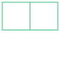
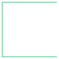
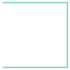

# Retrieval data types
{: .no_toc}

Multiple functions are available to serialize the Topology object. All of them are shown in this table below including the required hard and soft dependencies and further described below.

| Functions                       | Required Packages                                                       |
| ------------------------------- | ----------------------------------------------------------------------- |
| topojson.Topology().to_json()   | Shapely, NumPy                                                          |
| topojson.Topology().to_dict()   | Shapely, NumPy                                                          |
| topojson.Topology().to_svg()    | Shapely, NumPy                                                          |
| topojson.Topology().to_geojson()    | Shapely, NumPy                                                          |
| topojson.Topology().to_alt()    | Shapely, NumPy, _Altair\*_                                                |
| topojson.Topology().to_gdf()    | Shapely, NumPy, _GeoPandas\*_                                             |
| topojson.Topology().to_widget() | Shapely, NumPy, _Altair*_, _Simplification\*_, _ipywidgets* (+ labextension)_ |

_\* optional dependencies_

**Note:** Only the serialization to different output types is described here. See ['settings and tuning']({{site.baseurl}}/example/settings-tuning.html) for detailed examples of all options regarding creating the Topology object. 

1. TOC
{:toc}


* * *

## .to_json()

Serialize the Topology object into JSON. This is what is called TopoJSON.

<div class="code-example mx-1 bg-example">
<div class="example-label" markdown="1">
Example 🔧
{: .label .label-blue-000 }
</div>
<div class="example-text" markdown="1">

Given the following two polygons:
```python
import topojson as tp
from shapely import geometry

data = [
    {"type": "Polygon", "coordinates": [[[0, 0], [1, 0], [1, 1], [0, 1], [0, 0]]]},
    {"type": "Polygon", "coordinates": [[[1, 0], [2, 0], [2, 1], [1, 1], [1, 0]]]}
]
geometry.GeometryCollection([geometry.shape(g) for g in data])
```


The Topology can be computed

```python
topo = tp.Topology(data)
```

And serialized and saved into a JSON (TopoJSON) file:
```python
topo.to_json('my_file.topo.json')
```

To inspect the JSON object first, leave out the filepath (`fp`) argument.
```
print(topo.to_json())
```
<pre class="code_no_highlight">
{"type":"Topology","objects":{"data":{"geometries":[{"type":"Polygon","arcs":[[-2,0]]},{"type":"Polygon","arcs":[[1,2]]}],"type":"GeometryCollection"}},"bbox":[0.0,0.0,2.0,1.0],"transform":{"scale":[2.000002000002e-06,1.000001000001e-06],"translate":[0.0,0.0]},"arcs":[[[500000,0],[-500000,0],[0,999999],[500000,0]],[[500000,0],[0,999999]],[[500000,999999],[499999,0],[0,-999999],[-499999,0]]]}
</pre>
Default is a compact form of JSON. If you like a more readable format, set `pretty=True`.
```python
print(topo.to_json(pretty=True))
```
<pre class="code_no_highlight">
{
    "type": "Topology",
    "objects": {
        "data": {
            "geometries": [
                {"type": "Polygon", "arcs": [[-2, 0]]}, {"type": "Polygon", "arcs": [[1, 2]]}
            ],
            "type": "GeometryCollection"
        }
    },
    "bbox": [0.0, 0.0, 2.0, 1.0],
    "transform": {
        "scale": [2.000002000002e-06, 1.000001000001e-06], "translate": [0.0, 0.0]
    },
    "arcs": [
        [[500000, 0], [-500000, 0], [0, 999999], [500000, 0]], [[500000, 0], [0, 999999]],
        [[500000, 999999], [499999, 0], [0, -999999], [-499999, 0]]
    ]
}
</pre>
The `pretty` option depends on the setting `indent` and `maxlinelength`, these default to `4` and `88` respectively.
</div>
</div>

* * * 

## .to_dict()

Serialize the Topology object into a Python Dictionary.

<div class="code-example mx-1 bg-example">
<div class="example-label" markdown="1">
Example 🔧
{: .label .label-blue-000 }
</div>
<div class="example-text" markdown="1">

We use the data as is prepared in the [.to_json()](output-types.html#to_json) section.

```python
topo.to_dict()
```
<pre class="code_no_highlight">
{'type': 'Topology',
 'objects': {'data': {'geometries': [{'type': 'Polygon', 'arcs': [[-2, 0]]},
    {'type': 'Polygon', 'arcs': [[1, 2]]}],
   'type': 'GeometryCollection'}},
 'bbox': (0.0, 0.0, 2.0, 1.0),
 'transform': {'scale': [2.000002000002e-06, 1.000001000001e-06],
  'translate': [0.0, 0.0]},
 'arcs': [[[500000, 0], [-500000, 0], [0, 999999], [500000, 0]],
  [[500000, 0], [0, 999999]],
  [[500000, 999999], [499999, 0], [0, -999999], [-499999, 0]]]}
</pre>
In the computation of the Topology object a few options are adopted. To include these options in the Python Dictionary use `options=True`.

```python
topo.to_dict(options=True)
```
<pre class="code_no_highlight">
{'type': 'Topology',
 'objects': {'data': {'geometries': [{'type': 'Polygon', 'arcs': [[-2, 0]]},
    {'type': 'Polygon', 'arcs': [[1, 2]]}],
   'type': 'GeometryCollection'}},
 'bbox': (0.0, 0.0, 2.0, 1.0),
 'transform': {'scale': [2.000002000002e-06, 1.000001000001e-06],
  'translate': [0.0, 0.0]},
 'arcs': [[[500000, 0], [-500000, 0], [0, 999999], [500000, 0]],
  [[500000, 0], [0, 999999]],
  [[500000, 999999], [499999, 0], [0, -999999], [-499999, 0]]],
 'options': {'topology': True,
  'prequantize': True,
  'topoquantize': False,
  'presimplify': False,
  'toposimplify': False,
  'shared_coords': True,
  'prevent_oversimplify': True,
  'simplify_with': 'shapely',
  'simplify_algorithm': 'dp',
  'winding_order': 'CW_CCW'}}
</pre>  
</div>
</div>

* * * 

## .to_svg()

Serialize the Topology object into a visual Support Vector Graphic (SVG) mesh.

<div class="code-example mx-1 bg-example">
<div class="example-label" markdown="1">
Example 🔧
{: .label .label-blue-000 }
</div>
<div class="example-text" markdown="1">

We use the data as is prepared in the [.to_json()](output-types.html#to_json) section.
```python
topo.to_svg()
```


The output is a mesh and information of polygons are not included. To draw each captured linestring separate use `separate=True`.

```python
topo.to_svg(separate=True)
```
<pre class="code_no_highlight">
0 LINESTRING (1.000001000001 0, 0 0, 0 0.9999999999999999, 1.000001000001 0.9999999999999999)

1 LINESTRING (1.000001000001 0, 1.000001000001 0.9999999999999999)

2 LINESTRING (1.000001000001 0.9999999999999999, 2 0.9999999999999999, 2 0, 1.000001000001 0)

</pre>
</div>
</div>

* * * 

## .to_geojson()

Serialize the Topology object into GeoJSON. This destroys the Topology. 

<div class="code-example mx-1 bg-example">
<div class="example-label" markdown="1">
Example 🔧
{: .label .label-blue-000 }
</div>
<div class="example-text" markdown="1">

We use the data as is prepared in the [.to_json()](output-types.html#to_json) section.

Serialize and save into a JSON (GeoJSON) file
```python
topo.to_geojson('my_file.geo.json')
```

To inspect the JSON object first, leave out the filepath (`fp`) argument.
```
print(topo.to_geojson())
```
<pre class="code_no_highlight">
{"type":"FeatureCollection","features":[{"id":0,"type":"Feature","geometry":{"type":"Polygon","coordinates":[[[1.000001000001,0.9999999999999999],[0.0,0.9999999999999999],[0.0,0.0],[1.000001000001,0.0],[1.000001000001,0.9999999999999999]]]}},{"id":1,"type":"Feature","geometry":{"type":"Polygon","coordinates":[[[1.000001000001,0.0],[1.9999999999999998,0.0],[1.9999999999999998,0.9999999999999999],[1.000001000001,0.9999999999999999],[1.000001000001,0.0]]]}}]}
</pre>
Default is a compact form of JSON. If you like a more readable format, set `pretty=True`.
```python
print(topo.to_json(pretty=True))
```
<pre class="code_no_highlight">
{
    "type": "FeatureCollection",
    "features": [
        {
            "id": 0,
            "type": "Feature",
            "geometry": {
                "type": "Polygon",
                "coordinates": [
                    [
                        [1.000001000001, 0.9999999999999999], [0.0, 0.9999999999999999], [0.0, 0.0],
                        [1.000001000001, 0.0], [1.000001000001, 0.9999999999999999]
                    ]
                ]
            }
        },
        {
            "id": 1,
            "type": "Feature",
            "geometry": {
                "type": "Polygon",
                "coordinates": [
                    [
                        [1.000001000001, 0.0], [1.9999999999999998, 0.0],
                        [1.9999999999999998, 0.9999999999999999], [1.000001000001, 0.9999999999999999],
                        [1.000001000001, 0.0]
                    ]
                ]
            }
        }
    ]
}
</pre>
The `pretty` option depends on the setting `indent` and `maxlinelength`, these default to `4` and `88` respectively.

More options in generating the GeoJSON from the computed Topology are `validate` (`True` or `False`), `winding_order` and `decimals` and `object_name`. Where the TopoJSON standard defines a winding order of clock-wise orientation for outer polygons and counter-clockwise orientation for inner polygons is the winding order in the GeoJSON standard the opposite (`CCW_CW`). The `decimals` option defines the number of decimals for the output coordinates. With the option `object_name` it is possible to specify which object you want to serialize to GeoJSON (in case of multiple objects in the input data), defaults to index `0`.

</div>
</div>

* * * 

## .to_alt()

Serialize the Topology object into an Altair visualization. Altair is an optional dependency and not automatically installed.

<div class="code-example mx-1 bg-example">
<div class="example-label" markdown="1">
Example 🔧
{: .label .label-blue-000 }
</div>
<div class="example-text" markdown="1">

Here we load continental Africa as data file and apply a simplification on the arcs after the topology is computed using `toposimplify`.
```python
import topojson as tp

import topojson as tp
data = tp.utils.example_data_africa()

topo = tp.Topology(data, toposimplify=4)
```
Using `.to_alt()` function one can visualize the Topology using Altair. This means that the TopoJSON as data-object is included in the Vega-Lite specification generated by Altair. 

The default will render the Topology as a mesh, meaning that within Vega-Lite the TopoJSON input is rendered as a single unified MultiLineString GeoJSON instance. By default no projection is applied meaning that the input is rendered in a cartesian coordinate system

```python
# this requires the (optional!) package Altair.
topo.to_alt()
```
<div id="embed_output_mesh_altair"></div>

A few more convenience options are included for Altair visualizations, such as assigning a color property for individual features and using geographic projections and defining the `object_name`. With the option `object_name` it is possible to specify which object you want to serialize to Altair (in case of multiple objects in the input data), defaults to index `0`. 

Per TopoJSON specification, information of individual features are stored as an nested object within `properties`. For example here is shown the properties of the feature at index-0:

```
topo.to_dict()['objects']['data']['geometries'][0]
```
<pre class="code_no_highlight">
{'id': '1',
 'type': 'Polygon',
 'properties': {'continent': 'Africa',
  'gdp_md_est': 150600.0,
  'iso_a3': 'TZA',
  'name': 'Tanzania',
  'pop_est': 53950935},
 'bbox': (29.339997592900346,
  -11.720938002166735,
  40.31659000000002,
  -0.9500000000000001),
 'arcs': [[-6, 0, -84, -82, -77, -3, -100, -140, -137]]}
</pre>

Next, we map the property `name` of each feature as color property using a nominal (`:N`) encoding type. The `equalEarth` is used as geographic projection. By default tooltips are enabled.

```python
# this requires the (optional!) package Altair.
topo.to_alt(color='properties.name:N', projection='equalEarth')
```

<div id="embed_output_color_altair"></div>

**Note:** Type encoding needs to be specified and cannot be automatically inferred from TopoJSON input data.

</div>
</div>

* * * 

## .to_gdf()

Serialize the Topology object into a GeoPandas GeoDataFrame. This destroys the Topology. GeoPandas is an optional dependency and not automatically installed. With the option `object_name` it is possible to specify which object you want to serialize into a GeoDataFrame using the `object_name` (in case of multiple objects in the input data), defaults to index `0`.

**Note:** There is no winding-order enforcement in the OGR model; so the Fiona/OGR `TopoJSON` driver is NOT used in this routine, but the `.to_geojson()` function.  

<div class="code-example mx-1 bg-example">
<div class="example-label" markdown="1">
Example 🔧
{: .label .label-blue-000 }
</div>
<div class="example-text" markdown="1">

Given the included example data set of continental Africa and application of the Topology
```python
import topojson as tp

data = tp.utils.example_data_africa()

topo = tp.Topology(data)

# this requires the (optional!) package GeoPandas.
topo.to_gdf().head(3)
topo.to_gdf().plot()
```

|   |                                          geometry | id | continent | gdp_md_est | iso_a3 |            name |  pop_est |
|---|--------------------------------------------------:|---:|----------:|-----------:|-------:|----------------:|---------:|
| 0 | POLYGON ((33.90369435653969 -0.950000999735223... |  1 |    Africa |   150600.0 |    TZA |        Tanzania | 53950935 |
| 1 | POLYGON ((-8.665609889661543 27.65643955148528... |  2 |    Africa |      906.5 |    ESH |       W. Sahara |   603253 |
| 2 | POLYGON ((29.34002323977533 -4.500005567863123... | 11 |    Africa |    66010.0 |    COD | Dem. Rep. Congo | 83301151 |


</div>
</div>

* * * 

## .to_widget()

Serialize the Topology object into an interactive IPython Widget. This requires the optional packages simplification, altair and ipywidget(+lab extension). These are not installed automatically.

<div class="code-example mx-1 bg-example">
<div class="example-label" markdown="1">
Example 🔧
{: .label .label-blue-000 }
</div>
<div class="example-text" markdown="1">

Given the included example data set of continental Africa, one can enable the interactive IPython Widget as follow 
```python
import topojson as tp

data = tp.utils.example_data_africa()

topo = tp.Topology(data, prevent_oversimplify=False)

# this requires the (optional!) packages: simplification, altair & ipywidget(+labextension).
topo.to_widget()
```


**Note:** `prevent_oversimplify` is set to `False` since the Douglas-Peucker algorithm within `simplification` can not prevent oversimplification.

Custom slider options can be set using the `slider_toposimplify` and `slider_topoquantize` parameter settings. 
</div>
</div>

<script>
window.addEventListener("DOMContentLoaded", event => {
    var opt = {
        mode: "vega-lite",
        renderer: "svg",
        actions: false
    };

    var spec_mesh_altair = "{{site.baseurl}}/json/example_mesh.vl.json";
    vegaEmbed("#embed_output_mesh_altair", spec_mesh_altair, opt).catch(console.err);    

    var spec_color_altair = "{{site.baseurl}}/json/example_color_mark.vl.json";
    vegaEmbed("#embed_output_color_altair", spec_color_altair, opt).catch(console.err);    

});
</script>
<script type="text/javascript" src="https://cdn.jsdelivr.net/npm/vega@5"></script>
<script type="text/javascript" src="https://cdn.jsdelivr.net/npm/vega-lite@4"></script>
<script type="text/javascript" src="https://cdn.jsdelivr.net/npm/vega-embed@6"></script>
