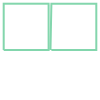
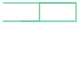
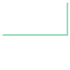
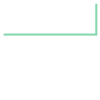
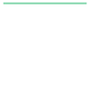
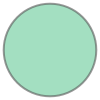
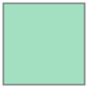

# Settings and tuning
{: .no_toc}

By adopting the TopoJSON format is possible to store geographical data as topology. Adopting this approach makes smaller files than its GeoJSON counterpart. This process allows varies options, which are described below:

1. TOC
{:toc}

* * * 

## topology

boolean
{: .text-delta}
Specify if the topology should be computed for deriving the TopoJSON.
Default is `True`.

<div class="code-example mx-1 bg-example">
<div class="example-label" markdown="1">
Example 🔧
{: .label .label-blue-000 }
</div>
<div class="example-text" markdown="1">

Given the following two linestrings with one side sharing:
```python
import topojson as tp
from shapely import geometry

data = geometry.MultiLineString([
    [[0, 0], [1, 0], [1, 1], [0, 1], [0, 0]], 
    [[1, 0], [2, 0], [2, 1], [1, 1], [1, 0]]
])
data
```


By setting `topology=False` a TopoJSON structured file format is created without considering shared segments (the setting `prequantize=False` avoids computing the delta-encoding):
```python
tp.Topology(data, topology=False, prequantize=False)
```
<pre class="code_no_highlight">
Topology(
{'arcs': [[[0.0, 0.0], [1.0, 0.0], [1.0, 1.0], [0.0, 1.0], [0.0, 0.0]],
          [[1.0, 0.0], [2.0, 0.0], [2.0, 1.0], [1.0, 1.0], [1.0, 0.0]]],
 'bbox': (0.0, 0.0, 2.0, 1.0),
 'coordinates': [],
 'objects': {'data': {'geometries': [{<strong>'arcs': [[0], [1]]</strong>,
                                      'type': 'MultiLineString'}],
                      'type': 'GeometryCollection'}},
 'type': 'Topology'}
)
</pre>
As can be seen, the geometries are referenced by two segments (`'arcs': [[0], [1]]`), where each segment is a single linestring (see: `arcs`).

When doing the same with `topology=True`, there are three `arcs`. Where one arc is referenced two times, namely arc `2` (arc `-3` is arc `2` reversed).
```python
tp.Topology(data, topology=False, prequantize=False)
```
<pre class="code_no_highlight">
Topology(
{'arcs': [[[1.0, 1.0], [0.0, 1.0], [0.0, 0.0], [1.0, 0.0]],
          [[1.0, 0.0], [2.0, 0.0], [2.0, 1.0], [1.0, 1.0]],
          [[1.0, 1.0], [1.0, 0.0]]],
 'bbox': (0.0, 0.0, 2.0, 1.0),
 'coordinates': [],
 'objects': {'data': {'geometries': [{<strong>'arcs': [[-3, 0], [1, 2]]</strong>,
                                      'type': 'MultiLineString'}],
                      'type': 'GeometryCollection'}},
 'type': 'Topology'}
)
</pre>
</div>
</div>


<!-- **Note:** The following figure is here to test if interactivity is possible

<div id="embed_tuning_topology"></div> -->


* * *         

## prequantize

boolean, int
{: .text-delta}

If the prequantization parameter is specified, the input geometry is 
quantized prior to computing the topology. The returned topology is 
quantized, and its arcs are delta-encoded. 

Quantization is recommended to 
improve the quality of the topology if the input geometry is messy (i.e., 
small floating point error means that adjacent boundaries do not have 
identical values); typical values are powers of ten, such as `1e4`, `1e5` or 
`1e6`. Default is `True` (which correspond to a quantize factor of `1e5`).

<div class="code-example mx-1 bg-example">
<div class="example-label" markdown="1">
Example 🔧
{: .label .label-blue-000 }
</div>
<div class="example-text" markdown="1">

Quantization is a two-step process, namely normalization and delta-encoding. Given the following two polygon with no sides shared, since the left-polygon has a x-max coordinate at `0.97` and the right-polygon has a x-min coordinate at `1.03`:
```python
import topojson as tp
from shapely import geometry

data = geometry.MultiLineString([
    [[0, 0], [0.97, 0], [0.97, 1], [0, 1], [0, 0]], 
    [[1.03, 0], [2, 0], [2, 1], [1.03, 1], [1.03, 0]]
])
data
```


The `prequantize` option is defined as an integer number. It can be best understand as a value that defines the size of a rectangular grid, with the bottom left coordinate at `(0,0)`. Next, the `x`-numbers and `y`-numbers of all coordinates are independency scaled and shifted on this rectangular grid (normalization on range). Here it is shown for the `x`-numbers only:
```python
# get the x-numbers of all coordinates
x = np.array([ls.xy[0] for ls in data])
print(f'x:\n{x}')
```
<pre class="code_no_highlight">
x:
[[0.   0.97 0.97 0.   0.  ]
 [1.03 2.   2.   1.03 1.03]]
</pre>
```python
# compute the scaling factor (kx) given the quantize factor (qf)
qf = 33
kx = (x.max() - x.min()) / (qf - 1)
print(f'kx: {kx}')
```
<pre class="code_no_highlight">
kx: 0.0625
</pre>
```python
# shift and apply the scaling factor to map the x-numbers on the integer range
xnorm = np.round((x - x.min()) / kx).astype(int)
print(f'x-normalized:\n{xnorm}')
```
<pre class="code_no_highlight">
x-normalized:
[[ 0 16 16  0  0]
 [16 32 32 16 16]]
</pre>
```python
# denormalize happens as follow
print(f'x-denormalized:\n{xnorm * kx + x.min()}')
```
<pre class="code_no_highlight">
x-denormalized:
[[0. 1. 1. 0. 0.]
 [1. 2. 2. 1. 1.]]
</pre>

The delta-encoding is applied on the normalized coordinates and starting from the first coordinate, only the delta towards the following coordinate is stored. It is a character-reducing process, since the delta between two points is normally smaller than storing both coordinates. Here an example is shown for the `x`-numbers only (1D), where in real it is a 2D process:
```python
# delta encoding of normalized x-numbers
x_quant = np.insert(np.diff(xnorm), 0, xnorm[:,0], axis=1)
print(f'x-quantized (normalized-delta-encoded):\n{x_quant}')
```
<pre class="code_no_highlight">
x-quantized (normalized-delta-encoded):
[[  0  16   0 -16   0]
 [ 16  16   0 -16   0]]
</pre>
```python
# dequantization of quantized x-numbers
x_dequant = x_quant.cumsum(axis=1) * kx + x.min()
print(f'x-dequantized:\n{x_dequant}')
```
<pre class="code_no_highlight">
x-dequantized:
[[0. 1. 1. 0. 0.]
 [1. 2. 2. 1. 1.]]
</pre>

So, to apply this `prequantize` value on the two no touching polygons, the polygons are touching as a result of it:
```python
topo = tp.Topology(data, prequantize=33)
topo.to_svg()
```

</div>
</div>

* * * 

## topoquantize

boolean or int
{: .text-delta}

If the topoquantization parameter is specified, the input geometry is quantized 
after the topology is constructed. If the topology is already quantized this 
will be resolved first before the topoquantization is applied. See for more 
details the `prequantize` parameter. Default is `False`.

See [prequantize](settings-tuning.html#prequantize) for an explained example.

**Note:** This is also supported by chaining. Meaning you could first compute the Topology (which can be cost-intensive) and afterwards apply the `topoquantize` on the computed Topology.


<div class="code-example mx-1 bg-example">
<div class="example-label" markdown="1">
Example 🔧
{: .label .label-blue-000 }
</div>
<div class="example-text" markdown="1">

```python
import topojson as tp
data = tp.utils.example_data_africa()

topo = tp.Topology(data)
topo_tq = topo.topoquantize(75)

print(f'length with topoquantization:    {len(topo_tq.to_json())}')
print(f'length without topoquantization: {len(topo.to_json())}')
```
<pre class="code_no_highlight">
length with topoquantization:    20391
length without topoquantization: 32549
</pre>
</div>
</div>


* * * 

## presimplify

boolean, float
{: .text-delta}

Apply presimplify to remove unnecessary points from linestrings before the 
topology is constructed. This will simplify the input geometries. Use with care. 
Default is `False`.

<div class="code-example mx-1 bg-example">
<div class="example-label" markdown="1">
Example 🔧
{: .label .label-blue-000 }
</div>
<div class="example-text" markdown="1">
Here we load continental Africa as data file and apply the `presimplify` on the input-space.
The plot shows the borders including linestring simplification, derived _before_ the `Topology` is computed.

```python
import topojson as tp
data = tp.utils.example_data_africa()

topo = tp.Topology(data, presimplify=4)

# since SVG rendering is too small for this example,
# we use the (optional!) package Altair for visualization.
topo.to_alt().properties(title='presimplify')
```
<div id="embed_tuning_presimplify"></div>
</div>
</div>
* * * 

## toposimplify

boolean, float 
{: .text-delta}

Apply toposimplify to remove unnecessary points from arcs after the topology 
is constructed. This will simplify the constructed arcs without altering the 
topological relations. Sensible values for coordinates stored in degrees are 
in the range of `0.0001` to `10`. Defaults to `False`.


**Note 1:** The units of `toposimplify` are corresponding to the input space. The provided _sensible_ values are for degrees (eg. `epsg:4326`). When the projection of your data is in `meters` you might need to test which value should be adopted.

**Note 2:** This is also supported by chaining. Meaning you could first compute the Topology (which can be cost-intensive) and afterwards apply the `toposimplify` on the computed Topology.

<div class="code-example mx-1 bg-example">
<div class="example-label" markdown="1">
Example 🔧
{: .label .label-blue-000 }
</div>
<div class="example-text" markdown="1">
Here we load continental Africa as data file and apply the `toposimplify` on the arcs.
The plot shows the borders including linestring simplification, derived _after_ the `Topology` is computed.

```python
import topojson as tp
data = tp.utils.example_data_africa()

topo = tp.Topology(data, toposimplify=4)

# since SVG rendering is too small for this example,
# we use the (optional!) package Altair for visualization.
topo.to_alt().properties(title='toposimplify')
```
<div id="embed_tuning_toposimplify"></div>
</div>
</div>


* * * 

## shared_coords

boolean
{: .text-delta}
Sets the strategy to detect junctions. When set to `False` a path is considered
shared when coordinates are the same path (`path-connected`). The path-connected
strategy is more 'correct', but slightly slower. When set to `True` a path is 
considered shared when all coordinates appear in both paths 
(`coords-connected`). Default is `False`.

<div class="code-example mx-1 bg-example">
<div class="example-label" markdown="1">
Example 🔧
{: .label .label-blue-000 }
</div>
<div class="example-text" markdown="1">
The example shows two LineStrings, the are partially overlapping with one shared coordinate.

```python
import topojson as tp
from shapely import geometry

data = geometry.MultiLineString([
    [(0, 0), (10, 0), (10, 5), (20, 5)], 
    [(5, 0), (20, 0), (20, 5), (10, 5), (0, 5)]
])
data
```


The setting `shared_coords=True` adopts a strategy of `coords-connected`, meaning it will split only when coordinates are detected in both linestrings. Here we show it as SVG, with each derived segment/arc plotted separately.

```python
tp.Topology(
    data, 
    shared_coords=True, 
    prequantize=False
).to_svg(separate=True)
```
<pre class="code_no_highlight">
0 LINESTRING (0 0, 10 0, 10 5)

1 LINESTRING (5 0, 20 0, 20 5)

2 LINESTRING (20 5, 10 5)

3 LINESTRING (10 5, 0 5)

</pre>
`LineString 2 (20 5, 10 5)` is the shared segment. 

When using the setting `shared_coords=False` a `path-connected` strategy is adopted, meaning it will split also when paths are overlapping without having common coordinates.

```python
tp.Topology(
    data, 
    shared_coords=False, 
    prequantize=False
).to_svg(separate=True)
```
<pre class="code_no_highlight">
0 LINESTRING (0 0, 5 0)

1 LINESTRING (10 0, 10 5)

2 LINESTRING (5 0, 10 0)

3 LINESTRING (10 0, 20 0, 20 5)

4 LINESTRING (20 5, 10 5)

5 LINESTRING (10 5, 0 5)

</pre>
`LineString 2 (5 0, 10 0)` and `LineString 4 (20 5, 10 5)` are shared segments. 
</div>
</div>

* * * 

## prevent_oversimplify

boolean
{: .text-delta}

If this setting is set to `True`, the simplification is slower, but the 
likelihood of producing valid geometries is higher as it prevents 
oversimplification. Simplification happens on paths separately, so this 
setting is especially relevant for rings with no partial shared paths. This 
is also known as a topology-preserving variant of simplification. 
Default is `True`. 

<div class="code-example mx-1 bg-example">
<div class="example-label" markdown="1">
Example 🔧
{: .label .label-blue-000 }
</div>
<div class="example-text" markdown="1">
The example shows a circle that is two times simplified. The first time with `prevent_oversimplify=False` and the second time with `prevent_oversimplify=True`.

```python
import topojson as tp
from shapely import geometry

circle = geometry.Point(0, 0).buffer(1)
circle
```


```python
# force simplification
tp.Topology(
    circle, 
    toposimplify=2,
    prevent_oversimplify=False
).to_svg()
```


```python
# avoid oversimplification
tp.Topology(
    circle, 
    toposimplify=2,
    prevent_oversimplify=True
).to_svg()
```

</div>
</div>


* * * 

## simplify_with

str
{: .text-delta}
Sets the package to use for simplifying (both pre- and toposimplify). Choose 
between `shapely` or `simplification`. Shapely adopts solely Douglas-Peucker 
and simplification both Douglas-Peucker and Visvalingam-Whyatt. The package 
simplification is known to be quicker than shapely. 
Default is `shapely`.

<div class="code-example mx-1 bg-example">
<div class="example-label" markdown="1">
Example 🔧
{: .label .label-blue-000 }
</div>
<div class="example-text" markdown="1">

```python
import topojson as tp
data = tp.utils.example_data_africa()

topo = tp.Topology(data, prequantize=200)

# we visualize with the (optional!) package Altair,
# since SVG rendering is too small for this example
topo.toposimplify(
    epsilon=1,
    simplify_algorithm='dp', 
    simplify_with='simplification', 
    prevent_oversimplify=False
).to_alt().properties(title='Douglas-Peucker (package simplification)')
```
<div id="embed_tuning_simplify_with"></div>
</div>
</div>

* * * 

## simplify_algorithm

str
{: .text-delta}

Choose between `dp` and `vw`, for Douglas-Peucker or Visvalingam-Whyatt 
respectively. `vw` will only be selected if `simplify_with` is set to 
`simplification`. Default is `dp`, since it still "produces the most accurate 
generalization" (Shi & Cheung, 2006).

<div class="code-example mx-1 bg-example">
<div class="example-label" markdown="1">
Example 🔧
{: .label .label-blue-000 }
</div>
<div class="example-text" markdown="1">
Here we use the `vw` algorithm from Visvalingam-Whyatt included in the package 
`simplification`.

```python
import topojson as tp
data = tp.utils.example_data_africa()

topo = tp.Topology(data, prequantize=200)

# we visualize with the (optional!) package Altair,
# since SVG rendering is too small for this example
topo.toposimplify(
    epsilon=1,
    simplify_algorithm='vw', 
    simplify_with='simplification', 
    prevent_oversimplify=True
).to_alt().properties(title='Visvalingam-Whyatt (package simplification)')
```
<div id="embed_tuning_simplify_alg"></div>
</div>
</div>

* * * 

## winding_order

str
{: .text-delta}

Determines the winding order of the features in the output geometry. Choose 
between `CW_CCW` for clockwise orientation for outer rings and counter-
clockwise for interior rings. Or `CCW_CW` for counter-clockwise for outer 
rings and clockwise for interior rings. Default is `CW_CCW`.

<div class="code-example mx-1 bg-example">
<div class="example-label" markdown="1">
Example 🔧
{: .label .label-blue-000 }
</div>
<div class="example-text" markdown="1">
Start with creating a `Polygon` geometry

```python
import topojson as tp
from shapely import geometry

data = geometry.shape({
    "type": "Polygon",
    "coordinates": [[[0,0],[10,0],[10,10],[0,10],[0,0]]]
})
data
```


Continue with defining two Topology objects, one with the outer rings clock wise and the inner rings counter clockwise (`CW_CCW`) and one with the outer rings counter clock wise and the inner rings clock wise (`CCW_CW`).

```python
CW_CCW = tp.Topology(data, winding_order='CW_CCW', prequantize=False)
CCW_CW = tp.Topology(data, winding_order='CCW_CW', prequantize=False)

print(CW_CCW)
print(CCW_CW)
```
<pre class="code_no_highlight">
Topology(
{'arcs': [[[0.0, 0.0], [0.0, 10.0], [10.0, 10.0], [10.0, 0.0], [0.0, 0.0]]],
 'bbox': (0.0, 0.0, 10.0, 10.0),
 'coordinates': [],
 'objects': {'data': {'geometries': [{'arcs': [[0]], 'type': 'Polygon'}],
                      'type': 'GeometryCollection'}},
 'type': 'Topology'}
)
Topology(
{'arcs': [[[0.0, 0.0], [10.0, 0.0], [10.0, 10.0], [0.0, 10.0], [0.0, 0.0]]],
 'bbox': (0.0, 0.0, 10.0, 10.0),
 'coordinates': [],
 'objects': {'data': {'geometries': [{'arcs': [[0]], 'type': 'Polygon'}],
                      'type': 'GeometryCollection'}},
 'type': 'Topology'}
)
</pre>
As you can see the `arcs` for type `Polygon` are reversed. The effect seems to be negligible, but the effect should be taken into account when using geographic projections, as it defines which part is 'inside' and 'outside' the `Polygon`:

```python
alt_top = CW_CCW.to_alt(projection='equalEarth', color='type:N').properties(title='CW_CCW')
alt_bottom = CCW_CW.to_alt(projection='equalEarth', color='type:N').properties(title='CCW_CW')

alt_top & alt_bottom
```
<div id="embed_tuning_winding_order"></div>
</div>
</div>


<script>
window.addEventListener("DOMContentLoaded", event => {
    var opt = {
        mode: "vega-lite",
        renderer: "svg",
        actions: false
    };

    var spec_presimplify = "{{site.baseurl}}/json/example_presimplify.vl.json";
    vegaEmbed("#embed_tuning_presimplify", spec_presimplify, opt).catch(console.err);

    var spec_toposimplify = "{{site.baseurl}}/json/example_toposimplify.vl.json";
    vegaEmbed("#embed_tuning_toposimplify", spec_toposimplify, opt).catch(console.err);

    var spec_simplify_with = "{{site.baseurl}}/json/example_simplify_with.vl.json";
    vegaEmbed("#embed_tuning_simplify_with", spec_simplify_with, opt).catch(console.err);   

    var spec_simplify_alg = "{{site.baseurl}}/json/example_simplify_alg.vl.json";
    vegaEmbed("#embed_tuning_simplify_alg", spec_simplify_alg, opt).catch(console.err);   

    var spec_winding_order = "{{site.baseurl}}/json/example_winding_order.vl.json";
    vegaEmbed("#embed_tuning_winding_order", spec_winding_order, opt).catch(console.err);     
});
</script>
<script type="text/javascript" src="https://cdn.jsdelivr.net/npm/vega@5"></script>
<script type="text/javascript" src="https://cdn.jsdelivr.net/npm/vega-lite@4"></script>
<script type="text/javascript" src="https://cdn.jsdelivr.net/npm/vega-embed@6"></script>
