# How it works
{: .no_toc}

With topojson it is possible to reduce the file size of your geographical data. This is often useful if you are aiming for browser-based visualizations (eg. visualizations in JupyterLab or on the Web).

As explained before we can do so through:

1. Eliminating redundancy through computation of a topology
2. Fixed-precision integer encoding of coordinates and
3. Simplification and quantization of arcs

## Topology computation
{: .no_toc}

While the 2nd and 3rd bullets from above list have a significant impact on the filesize reduction, we will describe here the 1st bullet _-the computation of the Topology-_ since it is basically the core of this library.


The computation of the Topology involves secure bookkeeping on multiple levels in order to successfully pass all steps. The following levels in derivation can be distinguished, which are explained below:

1. TOC
{:toc}

* * *

#### Toy example
{: .no_toc}

The following example data is used to clarify the steps:

<div class="code-example mx-1 bg-example">
<div class="example-label" markdown="1">
Example 🔧
{: .label .label-blue-000 }
</div>
<div class="example-text" markdown="1">

```python
from IPython.display import display, SVG
from shapely import geometry
import topojson as tp

data = geometry.MultiLineString([
    [(0, 0), (10, 0), (5, 5), (15, 5)], 
    [(15, 0), (15, 5), (5, 5), (0, 5)]
])

s = data._repr_svg_()
s = s.replace('stroke="#66cc99"', 'stroke="#F37929"', 1)
s = s.replace('stroke-width="0.324"', 'stroke-width="0.7"', 1)
display(SVG(s))
```
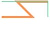

The orange line starts bottom-left and goes with a zig-zag to top-right. The green line starts bottom-right and goes up and then leftwards. Resulting in a shared segment for the two linestrings in opposite directions.
</div>
</div>

* * * 

## Extract

The first step is Extract. 

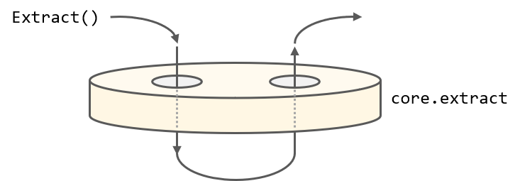

This class instance is determines the geometrical type of input data (eg. `dict`, `geojson.FeatureCollection`, `geopandas.GeoDataFrame`), and based on the type it extracts all geometric entities as `shapely.geometry.LineString`'s or `shapely.geometry.Point`'s and stores them in a top-level object with references in each geometric entity.

Target objectives:
   - Detection of geometrical type of the input data
   - Extraction of linestrings and points from all geometric entities


<div class="code-example mx-1 bg-example">
<div class="example-label" markdown="1">
Example 🔧
{: .label .label-blue-000 }
</div>
<div class="example-text" markdown="1">

We use the data as is prepared in the [toy example](how-it-works.html#toy-example) section.

```python
from topojson.core.extract import Extract
Extract(data)
```
<pre class="code_no_highlight">
Extract(
{'bookkeeping_coords': [],
 'bookkeeping_geoms': [[0], [1]],
 'coordinates': [],
 'linestrings': [<shapely.geometry.linestring.LineString object at 0x0000020C4B5B2E08>,
                 <shapely.geometry.linestring.LineString object at 0x0000020C4B5B2AC8>],
 'objects': {0: {'arcs': [0, 1], 'type': 'MultiLineString'}},
 'type': 'Topology'}
)
</pre>
The Extract class creates an object with a few different keys. From top to bottom are these
- `bookkeeping_coords` which stores the references to all point-coordinates. In this input are no existing point-coordinates.
- `bookkeeping_geoms` which stores the references to all geometries, such as LineStrings and Polygons.
- `coordinates` the actual point-coordinates
- `linestrings` all actual LineStrings extracted from both Polygons, LineStrings and LinearRings.
- `objects` a dictionary with all input objects. Here is presented a single MultiLineString with two referenced arcs.

The two referenced arcs `[0, 1]` refer to `0`-index and `1`-index entry in the `bookkeeping_geoms`. In this case `[0]` and `[1]` respectively.

```python
Extract(data).to_svg(separate=True)
```
<pre class="code_no_highlight">
0 LINESTRING (0 0, 10 0, 5 5, 15 5)
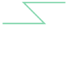
1 LINESTRING (15 0, 15 5, 5 5, 0 5)
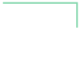
</pre>

</div>
</div>

* * *

## Join

The second step is Join. The Join class pass the data first _down_ towards the Extract class, before starting the Join phase. 

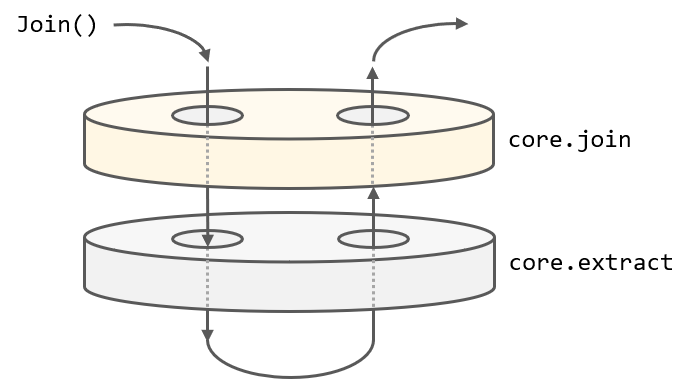

   - Quantization of input linestrings if necessary
   - Identifies junctions of shared paths

<div class="code-example mx-1 bg-example">
<div class="example-label" markdown="1">
Example 🔧
{: .label .label-blue-000 }
</div>
<div class="example-text" markdown="1">

We use the data as is prepared in the [toy example](how-it-works.html#toy-example) section.

```python
from topojson.core.join import Join
Join(data)
```
<pre class="code_no_highlight">
Join(
{'bbox': (0.0, 0.0, 15.0, 5.0),
 'bookkeeping_coords': [],
 'bookkeeping_geoms': [[0], [1]],
 'coordinates': [],
 'junctions': [<shapely.geometry.point.Point object at 0x0000020C8D94BC88>,
               <shapely.geometry.point.Point object at 0x0000020C8D975348>],
 'linestrings': [<shapely.geometry.linestring.LineString object at 0x0000020C8D94BE48>,
                 <shapely.geometry.linestring.LineString object at 0x0000020C8D956F08>],
 'objects': {0: {'arcs': [0, 1], 'type': 'MultiLineString'}},
 'type': 'Topology'}
)
</pre>
The Join class creates an object based on the Extract object. From top to bottom are these
- `bbox`: this is the maximum extent from all LineStrings and Coordinates stored within the `Extract` class.
- `bookkeeping_coords` see Extract.
- `bookkeeping_geoms` see Extract.
- `coordinates` the actual point-coordinates
- `junctions` the detected _end_-coordinates of a segment that is shared with at least two geometries.
- `linestrings` see Extract.
- `objects` see Extract.

The `junctions` is a new key that stores all junctions as a list of shapely Points.

```python
Join(data).to_svg(separate=True, include_junctions=True)
```
<pre class="code_no_highlight">
0 LINESTRING (0 0, 10 0, 5 5, 15 5)
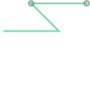
1 LINESTRING (15 0, 15 5, 5 5, 0 5)
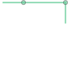
</pre>
</div>
</div>

* * *

## Cut

The third step is Cut. The Cut class passes the data first _down_ towards the Extract and subsequently Join class, before starting the Cut phase. 

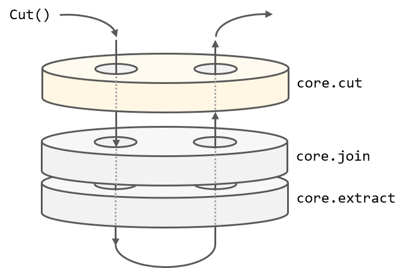

   - Split linestrings given the junctions of shared paths
   - Identifies indexes of linestrings that are duplicates

<div class="code-example mx-1 bg-example">
<div class="example-label" markdown="1">
Example 🔧
{: .label .label-blue-000 }
</div>
<div class="example-text" markdown="1">

We use the data as is prepared in the [toy example](how-it-works.html#toy-example) section.

```python
from topojson.core.cut import Cut
Cut(data)
```
<pre class="code_no_highlight">
Cut(
{'bbox': (0.0, 0.0, 15.0, 5.0),
 'bookkeeping_coords': [],
 'bookkeeping_duplicates': array([[3, 1]], dtype=int64),
 'bookkeeping_geoms': [[0], [1]],
 'bookkeeping_linestrings': array([[ 0.,  1., nan],
       [ 2.,  3.,  4.]]),
 'coordinates': [],
 'junctions': [<shapely.geometry.point.Point object at 0x0000020C8D937C48>,
               <shapely.geometry.point.Point object at 0x0000020C8D937688>],
 'linestrings': [array([[ 0.,  0.],
       [10.,  0.],
       [ 5.,  5.]]),
                 array([[ 5.,  5.],
       [15.,  5.]]),
                 array([[15.,  0.],
       [15.,  5.]]),
                 array([[15.,  5.],
       [ 5.,  5.]]),
                 array([[5., 5.],
       [0., 5.]])],
 'objects': {0: {'arcs': [0, 1], 'type': 'MultiLineString'}},
 'type': 'Topology'}
)
</pre>
The Cut class creates an object based on the Join object. From top to bottom are these
- `bbox`: see Join. Not changed.
- `bookkeeping_coords` see Extract. Not changed.
- `bookkeeping_duplicates` nested arrays where each array are the referenced linestrings that are duplicates (albeit reversed) from each other.
- `bookkeeping_geoms` see Extract. Not changed.
- `bookkeeping_linestrings` since the linestrings are split using the junction-points, this key maintain the bookkeeping which LineStrings appeared in which geometry.
- `coordinates` see Extract. Not changed.
- `junctions` see Extract. Not changed.
- `linestrings` in the process of splitting LineStrings on detected junctions, the object type is changed from shapely LineString to NumPy arrays in order to make use of matrix-wise splitting.
- `objects` see Extract. Not changed.

The `bookkeeping_linestrings` is a new key.

```python
Cut(data).to_svg(separate=True, include_junctions=True)
```
<pre class="code_no_highlight">
0 LINESTRING (0 0, 10 0, 5 5)
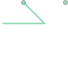
1 LINESTRING (5 5, 15 5)

2 LINESTRING (15 0, 15 5)
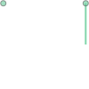
3 LINESTRING (15 5, 5 5)

4 LINESTRING (5 5, 0 5)
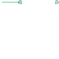
</pre>
</div>
</div>

* * *

## Dedup

The fourth step is Dedup. The Dedup class passes the data first _down_ towards the Extract and subsequently Join and Cut class, before starting the Dedup phase.

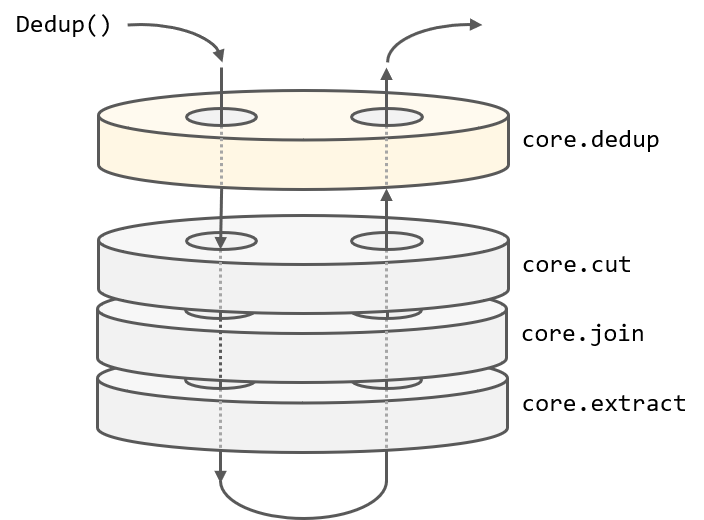

   - Deduplication of linestrings that contain duplicates
   - Merge contiguous arcs

<div class="code-example mx-1 bg-example">
<div class="example-label" markdown="1">
Example 🔧
{: .label .label-blue-000 }
</div>
<div class="example-text" markdown="1">

We use the data as is prepared in the [toy example](how-it-works.html#toy-example) section.

```python
from topojson.core.dedup import Dedup
Dedup(data)
```
<pre class="code_no_highlight">
Dedup(
{'bbox': (0.0, 0.0, 15.0, 5.0),
 'bookkeeping_arcs': [[0, 2], [1, 2, 3]],
 'bookkeeping_coords': [],
 'bookkeeping_duplicates': [],
 'bookkeeping_geoms': [[0], [1]],
 'bookkeeping_shared_arcs': [2],
 'coordinates': [],
 'junctions': [<shapely.geometry.point.Point object at 0x0000020C8D956848>,
               <shapely.geometry.point.Point object at 0x0000020C8D956908>],
 'linestrings': [array([[ 0.,  0.],
       [10.,  0.],
       [ 5.,  5.]]),
                 array([[15.,  0.],
       [15.,  5.]]),
                 array([[15.,  5.],
       [ 5.,  5.]]),
                 array([[5., 5.],
       [0., 5.]])],
 'objects': {0: {'arcs': [0, 1], 'type': 'MultiLineString'}},
 'type': 'Topology'}
)
</pre>
The Dedup class creates an object based on the Cut object. From top to bottom are these
- `bbox`: see Join. Not changed.
- `bookkeeping_arcs` this is the resolved version of `bookkeeping_linestrings`,  where the linestring indexed by `2` is referred in both arcs.
- `bookkeeping_coords` see Extract. Not changed.
- `bookkeeping_duplicates` duplicates are resolved in the key `bookkeeping_arcs`.
- `bookkeeping_geoms` see Extract. Not changed.
- `bookkeeping_shared_arcs` object that stores the linestrings that are shared
- `coordinates` see Extract. Not changed.
- `junctions` see Extract. Not changed.
- `linestrings` during deduplication the linestring that are seen as duplicates are popped.
- `objects` see Extract. Not changed.

The `bookkeeping_arcs` and `bookkeeping_shared_arcs` are new keys that stores all shared arcs and maintain bookkeeping.

```python
Dedup(data).to_svg(separate=True)
```
<pre class="code_no_highlight">
0 LINESTRING (0 0, 10 0, 5 5)
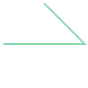
1 LINESTRING (15 0, 15 5)
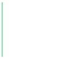
2 LINESTRING (15 5, 5 5)
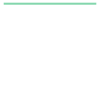
3 LINESTRING (5 5, 0 5)

</pre>
</div>
</div>

* * *

## Hashmap

The fifth step is Hashmap. The Hashmap class passes the data first _down_ towards the Extract and subsequently Join, Cut and Dedup class, before starting the Hashmap phase.

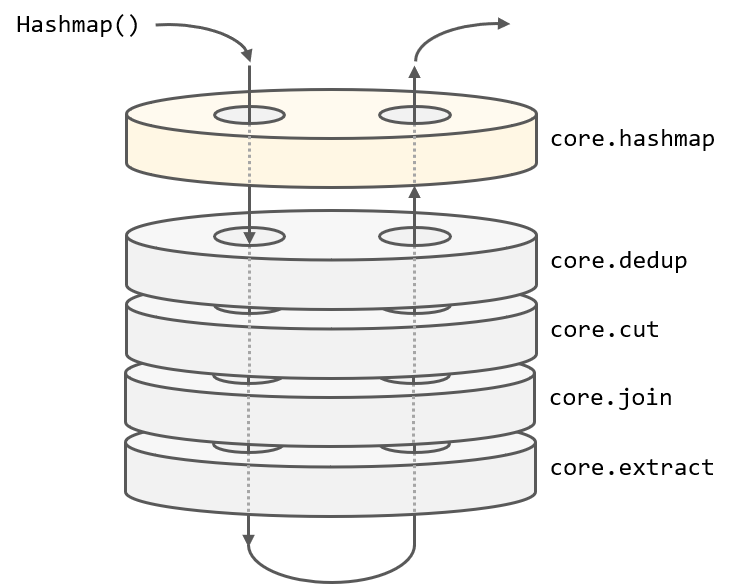

   - Resolves bookkeeping results to object arcs.

<div class="code-example mx-1 bg-example">
<div class="example-label" markdown="1">
Example 🔧
{: .label .label-blue-000 }
</div>
<div class="example-text" markdown="1">

We use the data as is prepared in the [toy example](how-it-works.html#toy-example) section.

```python
from topojson.core.hashmap import Hashmap
Hashmap(data)
```
<pre class="code_no_highlight">
Hashmap(
{'bbox': (0.0, 0.0, 15.0, 5.0),
 'coordinates': [],
 'linestrings': [array([[ 0.,  0.],
       [10.,  0.],
       [ 5.,  5.]]),
                 array([[15.,  0.],
       [15.,  5.]]),
                 array([[15.,  5.],
       [ 5.,  5.]]),
                 array([[5., 5.],
       [0., 5.]])],
 'objects': {'data': {'geometries': [{'arcs': [[0, -3], [1, 2, 3]],
                                      'type': 'MultiLineString'}],
                      'type': 'GeometryCollection'}},
 'type': 'Topology'}
)
</pre>
The Hashmap class creates an object based on the Dedup object. From top to bottom are these
- `bbox`: see Join. Not changed.
- `coordinates` see Extract. Not changed.
- `linestrings` see Dedup. Not changed.
- `objects` in the `arcs` object the geometries are resolved using `bookkeeping_geom` which uses the `bookkeeping_arcs`. In this process the shared arcs are analyzed if they should be reversed or not in the referred geometry. Observer `-3` and `2`.

The `bookkeeping_*` keys are removed and the `arcs` for each geometry within `objects` is updated.

</div>
</div>

* * *

## Topology

The sixth and last step is Topology. The Topology class passes the data first _down_ towards the Extract and subsequently Join, Cut, Dedup and Hashmap class, before starting the Topology phase.

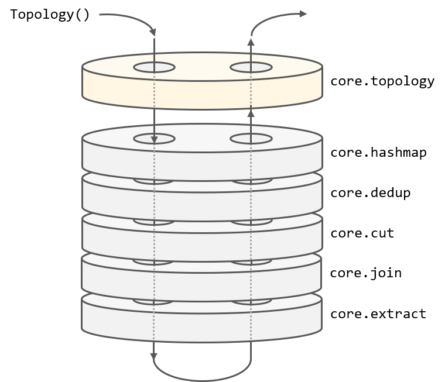

   - Applies all custom settings and output functions.

<div class="code-example mx-1 bg-example">
<div class="example-label" markdown="1">
Example 🔧
{: .label .label-blue-000 }
</div>
<div class="example-text" markdown="1">

We use the data as is prepared in the [toy example](how-it-works.html#toy-example) section.

```python
from topojson.core.topology import Topology
Topology(data)
```
<pre class="code_no_highlight">
Topology(
{'arcs': [[[0, 0], [666666, 0], [-333333, 999999]],
          [[999999, 0], [0, 999999]],
          [[999999, 999999], [-666666, 0]],
          [[333333, 999999], [-333333, 0]]],
 'bbox': (0.0, 0.0, 15.0, 5.0),
 'coordinates': [],
 'objects': {'data': {'geometries': [{'arcs': [[0, -3], [1, 2, 3]],
                                      'type': 'MultiLineString'}],
                      'type': 'GeometryCollection'}},
 'transform': {'scale': [1.5000015000015e-05, 5.000005000005e-06],
               'translate': [0.0, 0.0]},
 'type': 'Topology'}
)
</pre>
The Topology class creates an object based on the Hashmap object. From top to bottom are these
- `arcs`: the in `linestring` stored NumPy is quantized (normalized, delta-encoded) and converted into lists.
- `bbox`: see Join. Not changed.
- `coordinates` see Extract. Not changed.
- `objects` see Hashmap. Not changed.
- `transform` stores the `scale` and `translate` keys, which can be used for dequantization of the quantized arcs.

The `arcs` key is created storing the quantized linestrings, where shared arcs are referred from within each geometry.

```python
Topology(data).to_svg()
```
<pre class="code_no_highlight">
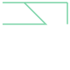
</pre>

</div>
</div>

* * * 
The names are borrowed from the JavaScript variant of TopoJSON, to establish a certain synergy between the packages, even though the code differs significant (and sometimes even the TopoJSON output).